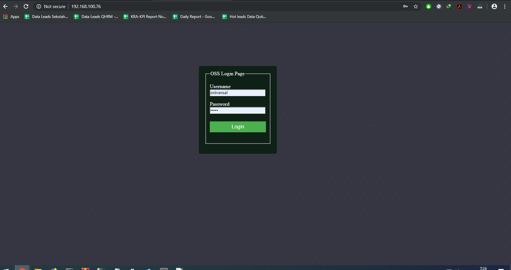
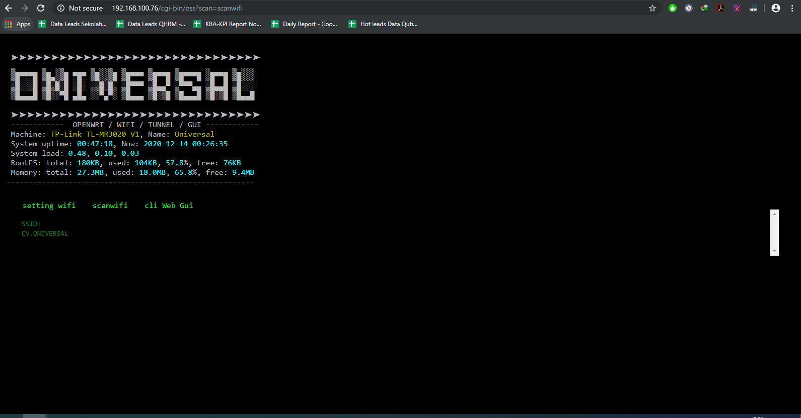
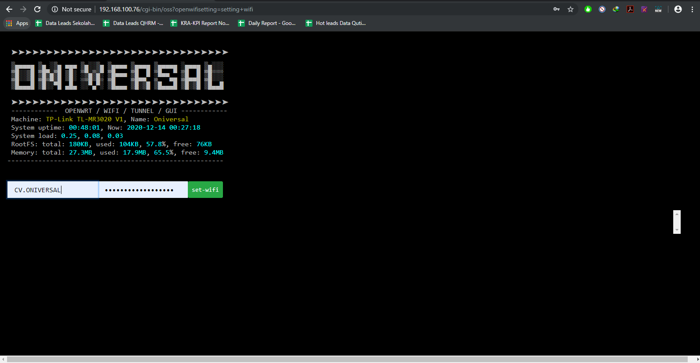
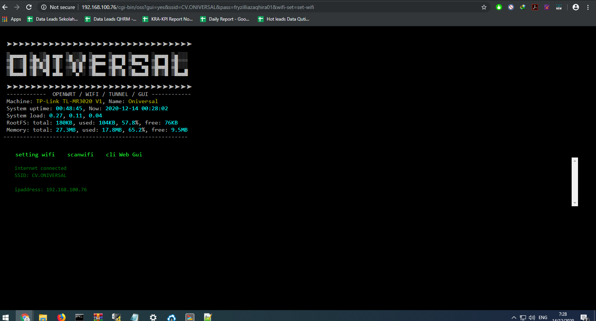

# oss_openwrt_tiny_web
jangan lupa compile membutuhkan SHC untuk encrypt script oss
<ul>
  <li>LOGIN PAGE</li>
  </img>
  <li>WEB SHELL GUI</li>
  </img>
  <li>SCAN WIFI</li>
  </img>
  <li>WIFI MANAGEMENT</li>
  </img>
  <li>WIFI CONNECTION CHECKER</li>
  </img>
</ul>
  
